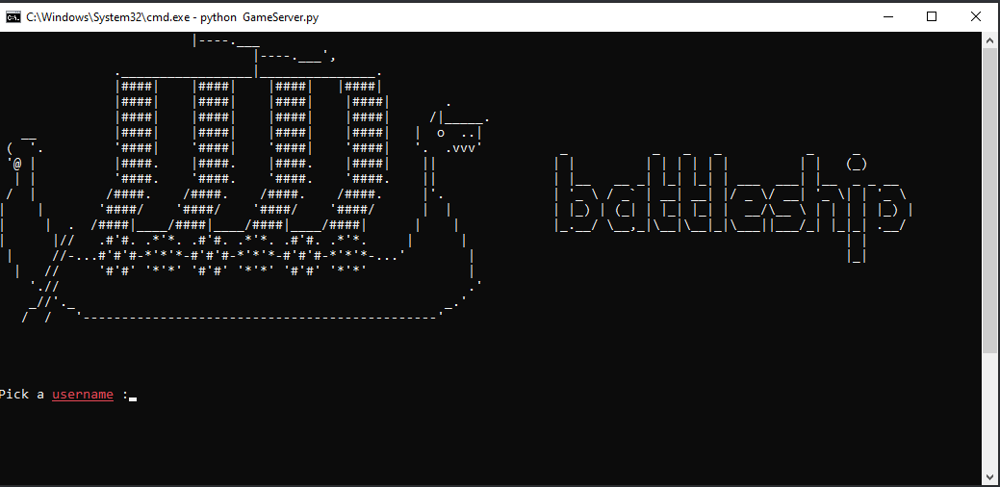
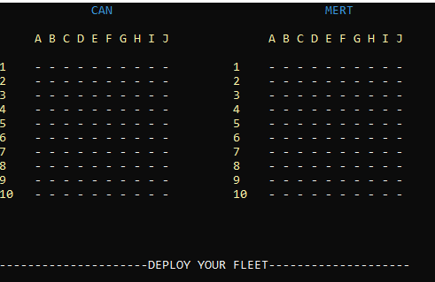
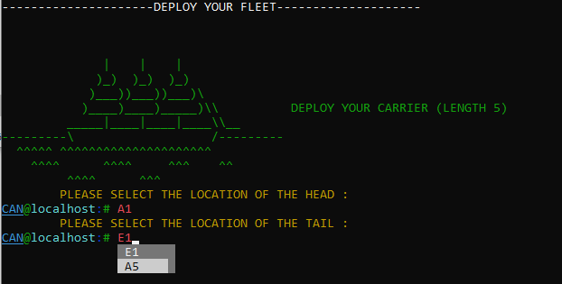
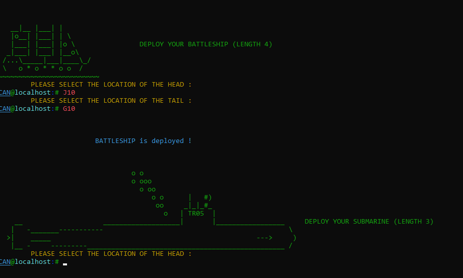
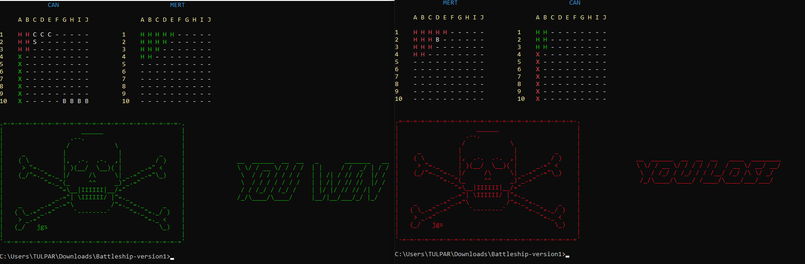

# Battleship Terminal Game
## Description 
In this project, the [Battleship Game](https://en.wikipedia.org/wiki/Battleship_(game)) is implemented as a terminal based game which can be played within the local host of the players'.

## Features
* Python3
* TCP
* Class Project - CS 447 Computer Networks Fall 2021-22

## Usage

* To start the game, one of the players needs to run the './GameServer.py' script in project directory. Server by default starts on port '5050' and awaits for a client.
* A second player needs to run the 'GameClient.py' script and connects to server via a specified port and a host name.[BY DEFAULT PORT : 5050, IP : 127.0.0.1] 
* After the client has successfully connected, game starts and can be played with detailed instructions displayed in the prompt.

## GameClient.py Arguments

Arguments can be specified as follows.
e.g --> python GameClient.py --ip '127.0.0.1' -p 5050

## IMPORTANT

If nothing is prompted, press 'TAB'. Sometimes prompt can be buggy.

## Samples
### Player Welcome Prompt 

### Boards 

### Deploy Your Fleet Sample 1

### Deploy Your Fleet Sample 2

### Win-Lose Screen
